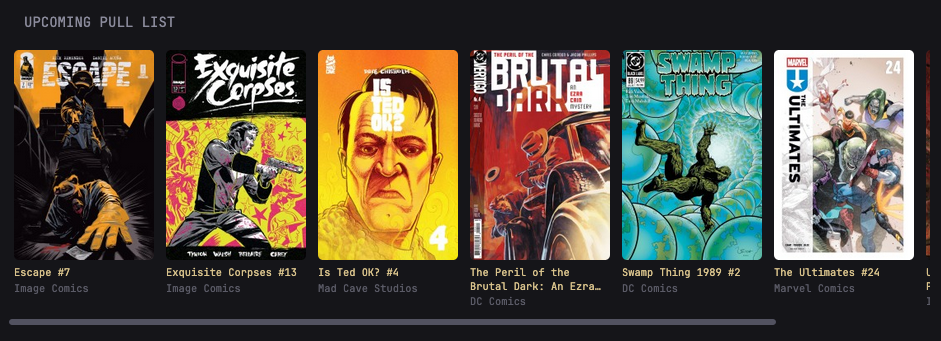
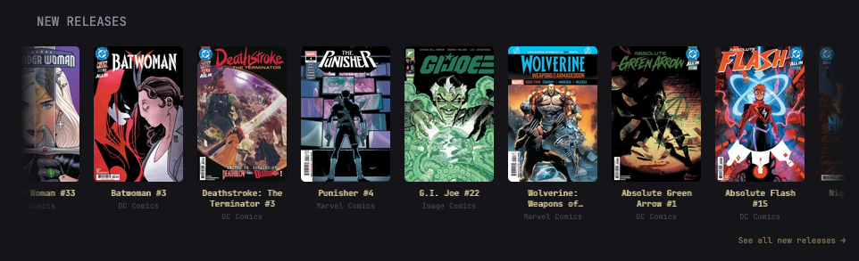
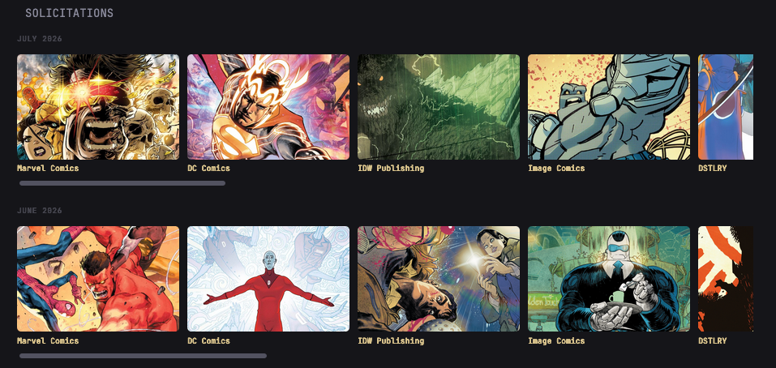
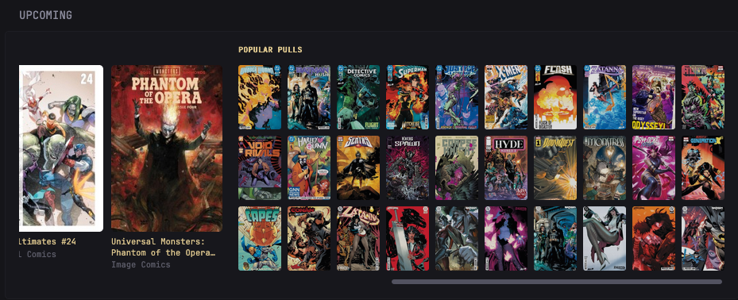
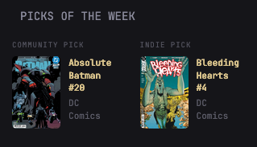

# glance-league-of-comic-geeks

Comic book data from League of Comic Geeks as a Glance widget backend. Pull your pull list, check new releases, browse solicitations, and get weekly picks without leaving your dashboard.

## What it does

This service scrapes League of Comic Geeks and serves it as JSON so Glance can display it. No API key needed — just your League of Comic Geeks user ID.

**Endpoints:**
- `/pull-list` — Your weekly pull list
- `/new-releases` — This week's new releases sorted by popularity
- `/solicitations` — Upcoming solicitations grouped by month
- `/discovery` — Community and indie picks of the week
- `/pull-list-plus-popular` — Your pulls + popular picks (deduplicated)

## Setup

### Docker

```bash
docker compose up -d --build
```

Service runs on `http://locg_bridge:4463` when using the included docker-compose.yml.

### Local

```bash
cd API
pip install -r requirements.txt
python -m uvicorn main:app --host 0.0.0.0 --port 4463
```

## Finding your League of Comic Geeks ID

1. Log in to [leagueofcomicgeeks.com](https://leagueofcomicgeeks.com)
2. Go to your profile
3. Your ID is the number in the URL: `https://leagueofcomicgeeks.com/profile/YOUR_ID/...`

## Glance Config

Example configs are in `config/` — pick the ones you want and add them to your Glance config. Replace `YOUR_USER_ID` with your actual ID (only needed for pull list endpoints).

```yaml
- type: custom-api
  title: Pull List
  url: http://locg_bridge:4463/pull-list?user_id=YOUR_USER_ID
  template: |
    {{ $items := .JSON.Array "" }}
    {{ range $items }}
      <div>{{ .String "title" }} • {{ .String "publisher" }}</div>
    {{ end }}
```

See `config/locg-pulllist.yml` and others for complete examples.

## Screenshots

### Pull List


### New Releases


### Solicitations


### Popular Pulls


### Weekly Picks


## How it works

Startup pre-warms the cache with discovery, new releases, and solicitations data. Everything caches for 1 hour to avoid hammering League of Comic Geeks. Pull list requests don't cache (always fresh) since they're user-specific.

## Requirements

- Docker
- A League of Comic Geeks account

## License

MIT